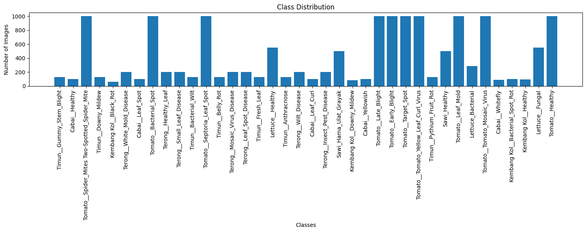
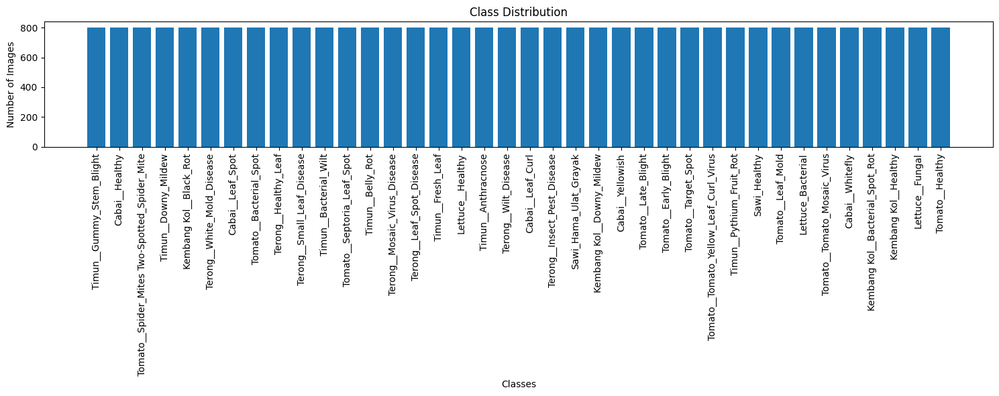
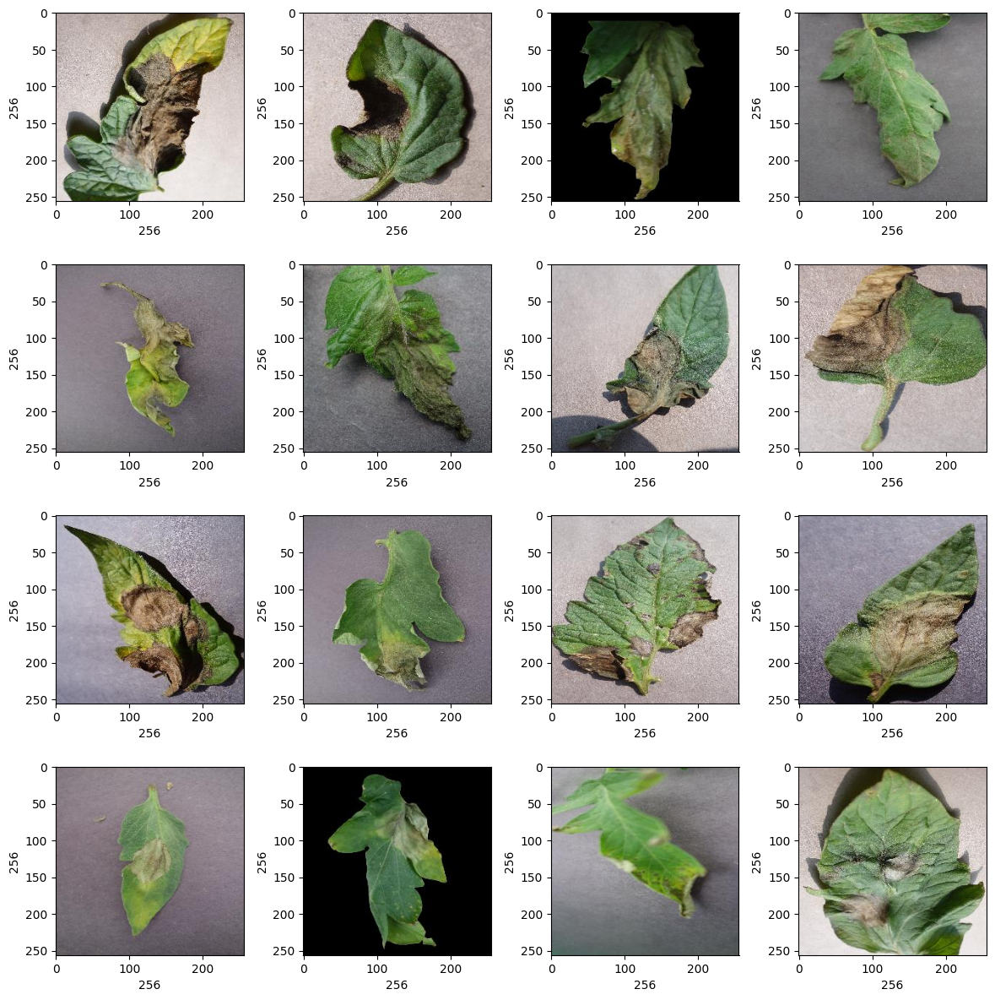

# Vegecare: Smart Solutions for Nurturing Plant Health

## Overview
This project implements a machine learning model to classify plant diseases using convolutional neural networks (CNNs). It leverages a MobileNetV2 base model for transfer learning, followed by custom layers to classify various plant disease types. The dataset consists of images of different vegetables and diseases, and the model is fine-tuned to improve accuracy.

The goal of this project is to build a model that can accurately classify plant diseases based on images. The dataset consists of various categories for different plants and their respective diseases. The model uses MobileNetV2 for feature extraction, followed by custom layers for classification.

## Dataset
The dataset used for training is a collection of images containing different types of plant diseases. The dataset has been split into training, validation, and test directories.

### Dataset distribution

### Dataset distribution after augmentation

## Dataset example
The dataset contains images of various plant diseases, such as:

## Key Steps:
Data Preprocessing: Loading and preprocessing images from the dataset.
Model Architecture: Implementing a MobileNetV2-based transfer learning model with added layers for fine-tuning.
Training and Evaluation: Training the model on a labeled dataset and evaluating its performance using metrics such as accuracy, F1 score, and confusion matrix.

## Model Architecture
The model architecture consists of:

- Base Model: MobileNetV2 pre-trained on ImageNet.
- Custom Layers: Convolutional layers, max-pooling, dropout, and dense layers for classification.
- Output Layer: Softmax activation for multi-class classification.

```mermaid
flowchart LR
    input_layer --> mobilenetv2
    mobilenetv2 --> conv2d
    conv2d --> max_pooling
    max_pooling --> dropout1
    dropout1 --> flatten
    flatten --> dense1
    dense1 --> dropout2
    dropout2 --> output_layer

    input_layer[Input Layer: 224x224x3]
    mobilenetv2[MobileNetV2: Pretrained Backbone]
    conv2d[Conv2D: 256 Filters, 3x3, ReLU]
    max_pooling[MaxPooling2D: 2x2]
    dropout1[Dropout: Rate 0.5]
    flatten[Flatten Layer]
    dense1[Dense: 256 Units, ReLU]
    dropout2[Dropout: Rate 0.5]
    output_layer[Output Layer: Softmax, 38 Classes]

```

## Evaluation
The model is evaluated using metrics such as accuracy, F1 score, and confusion matrix. The evaluation results help in understanding the model's performance and identifying areas for improvement.

We trained our model using 3 pretrained model : MobilenetV2, InceptionV3, and MobileNetV3Large. We train using 50 epochs and datasplit of 80 : 10 : 10.

| Model          | Accuracy | F1    |          
| -------------- | -------- | ----- |
| MobileNetV2    | 0.92    | 0.91 |
| InceptionV3       | 0.88    | 0.88 |
| MobileNetV3Large   | 0.6    | 0.59 |

